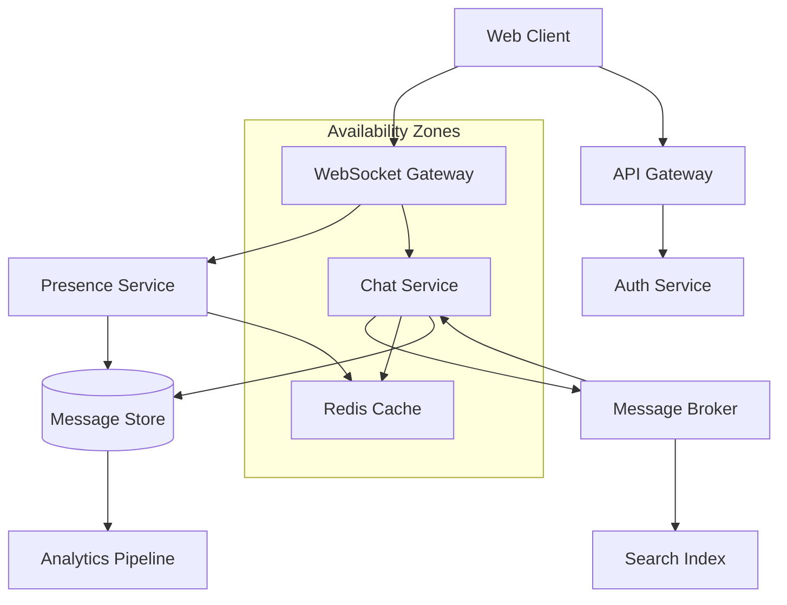

# Example 1: Real-time Chat Application

## Requirement

Design a real-time chat application supporting 10,000 concurrent users with message persistence, typing indicators, and online presence.

## Input

```json
{
  "requirement": "Design a real-time chat application supporting 10,000 concurrent users with message persistence, typing indicators, and online presence",
  "constraints": {
    "max_latency_ms": 200,
    "availability_target": 0.99,
    "data_retention_days": 90
  },
  "options": {
    "include_failure_modes": true,
    "include_adrs": true,
    "include_mermaid": true
  }
}
```

## Generated Architecture

### Components

| Component | Type | Technology | Instances |
|-----------|------|------------|-----------|
| API Gateway | gateway | Kong/Nginx | 3 |
| WebSocket Gateway | service | Socket.IO | 5 |
| Chat Service | service | FastAPI | 4 |
| Presence Service | service | Node.js | 2 |
| Message Broker | queue | Redis Pub/Sub | 3 |
| Cache | cache | Redis Cluster | 3 |
| Message Store | database | PostgreSQL | 2 |
| Search Index | search | Elasticsearch | 2 |
| CDN | cdn | CloudFront | - |

### Architecture Diagram



### Key Decisions (ADRs)

**ADR-001: WebSocket for Real-time Communication**
- Context: Chat requires sub-second message delivery
- Decision: Use WebSocket connections via Socket.IO
- Consequences: Increased complexity, but better UX

**ADR-002: Redis for Presence Tracking**
- Context: Need to track online/offline status for 10k users
- Decision: Use Redis with sorted sets for presence
- Consequences: Fast lookups, requires Redis expertise

### Failure Modes

| Component | Failure Mode | Impact | Mitigation |
|-----------|--------------|--------|------------|
| WebSocket Gateway | Connection drops | Medium | Client reconnection logic |
| Message Broker | Message loss | High | Persistent queues, acknowledgments |
| Database | Write latency | Medium | Read replicas, caching |

## Implementation Phases

1. **Foundation (Week 1-2)**: Infrastructure setup, API Gateway
2. **Core (Week 3-4)**: WebSocket implementation, basic messaging
3. **Presence (Week 5)**: Online status, typing indicators
4. **Search (Week 6)**: Message search with Elasticsearch
5. **Scale (Week 7-8)**: Load testing, optimization

## Cost Estimate

- Infrastructure: ~$2,000/month for 10k users
- Development: ~40 developer-weeks
