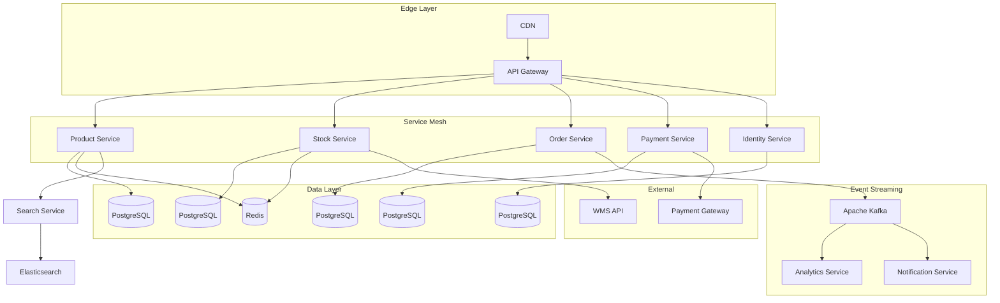

# Example 2: E-commerce Microservices Platform

## Requirement

Build a scalable e-commerce platform handling 1 million SKUs, with real-time inventory updates, payment processing, and order fulfillment tracking.

## Input

```json
{
  "requirement": "Build a scalable e-commerce platform handling 1 million SKUs, with real-time inventory updates, payment processing, and order fulfillment tracking",
  "constraints": {
    "availability_target": 0.999,
    "p99_latency_ms": 300,
    "payment_compliance": ["PCI-DSS"],
    "inventory_accuracy": 99.9
  },
  "options": {
    "include_failure_modes": true,
    "include_adrs": true,
    "include_mermaid": true,
    "depth": "comprehensive"
  }
}
```

## Generated Architecture

### Domain Services

| Domain | Service | Technology | Scalability |
|--------|---------|------------|-------------|
| Catalog | Product Service | Go | Horizontal |
| Inventory | Stock Service | Rust | Horizontal |
| Orders | Order Service | Python | Horizontal |
| Payments | Payment Service | Java | Horizontal |
| Users | Identity Service | Node.js | Horizontal |
| Search | Search Service | Elasticsearch | Horizontal |
| Analytics | Analytics Service | Kafka + Flink | Horizontal |

### Core Components

| Component | Type | Technology | Notes |
|-----------|------|------------|-------|
| API Gateway | gateway | Kong | Rate limiting, auth |
| Service Mesh | network | Istio | mTLS, load balancing |
| Message Bus | queue | Apache Kafka | Event streaming |
| Primary DB | database | PostgreSQL | Per-service DBs |
| Cache | cache | Redis | Distributed cache |
| Search | search | Elasticsearch | Product search |
| Object Storage | storage | S3/MinIO | Images, assets |
| CDN | cdn | CloudFront | Static content |

### Architecture Diagram



### Key Decisions (ADRs)

**ADR-001: Per-Service Database Pattern**
- Context: Need loose coupling between services
- Decision: Each service owns its database (Database per Service pattern)
- Consequences: Increased operational complexity, better fault isolation

**ADR-002: Event Sourcing for Inventory**
- Context: Need audit trail and eventual consistency
- Decision: Implement event sourcing for stock movements
- Consequences: Higher complexity, better traceability

**ADR-003: Synchronous vs Asynchronous**
- Context: Payment processing needs consistency
- Decision: Synchronous for payments, async for notifications
- Consequences: Complexity in ordering, but better UX

### Failure Modes

| Service | Failure Mode | Detection | Mitigation |
|---------|--------------|-----------|------------|
| Inventory | Overselling | Idempotency keys | Reserve-then-confirm |
| Payments | Double charge | Idempotency | Transaction logs |
| Orders | Lost orders | Saga pattern | Compensation logic |
| Search | Stale data | Periodic sync | Event-driven updates |

### Database Schema Highlights

**Inventory Service**
```sql
CREATE TABLE inventory (
    sku VARCHAR(50) PRIMARY KEY,
    quantity INTEGER NOT NULL,
    reserved INTEGER DEFAULT 0,
    version INTEGER DEFAULT 0,
    updated_at TIMESTAMP
);

CREATE TABLE inventory_events (
    id UUID PRIMARY KEY,
    sku VARCHAR(50),
    event_type VARCHAR(20),
    quantity_change INTEGER,
    created_at TIMESTAMP
);
```

## Implementation Phases

1. **Foundation (Weeks 1-4)**: API Gateway, Service Mesh, base infrastructure
2. **Core Services (Weeks 5-10)**: Catalog, Inventory, Orders services
3. **Payments (Weeks 11-14)**: Payment integration, PCI compliance
4. **Search & Analytics (Weeks 15-18)**: Elasticsearch, Kafka analytics
5. **Performance (Weeks 19-22)**: Load testing, optimization
6. **Security (Weeks 23-24)**: Penetration testing, compliance audit

## Cost Estimate

- Infrastructure: ~$15,000/month for 1M SKUs
- Compliance (PCI): ~$50,000 one-time
- Development: ~200 developer-weeks
