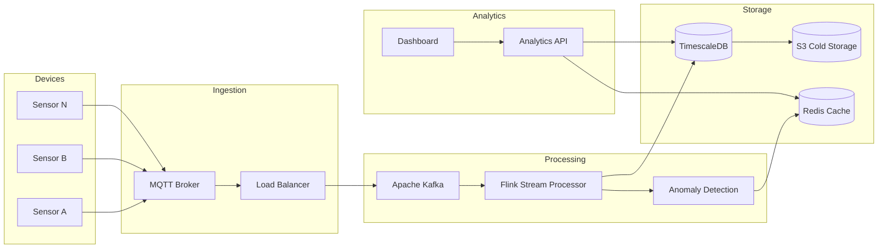

# Example 3: IoT Sensor Data Platform

## Requirement

Design an IoT platform ingesting 1 million sensor readings per second, with real-time anomaly detection, 30-day data retention, and historical analytics.

## Input

```json
{
  "requirement": "Design an IoT platform ingesting 1 million sensor readings per second, with real-time anomaly detection, 30-day data retention, and historical analytics",
  "constraints": {
    "ingestion_rate": "1M events/second",
    "retention_days": 30,
    "anomaly_detection_latency_ms": 500,
    "max_storage_tb": 100
  },
  "options": {
    "include_failure_modes": true,
    "include_adrs": true,
    "include_mermaid": true
  }
}
```

## Generated Architecture

### Data Pipeline Components

| Layer | Component | Technology | Throughput |
|-------|-----------|------------|------------|
| Ingestion | IoT Gateway | MQTT Broker | 1M/sec |
| Stream Processing | Stream Processor | Apache Flink | 500K/sec |
| Real-time Analytics | Anomaly Engine | Python/ML | 100K/sec |
| Message Queue | Event Hub | Apache Kafka | 1M/sec |
| Storage (Hot) | Time-series DB | TimescaleDB | - |
| Storage (Cold) | Object Store | S3 | - |
| Cache | In-memory | Redis | - |

### Architecture Diagram



### Key Decisions (ADRs)

**ADR-001: Kafka for Message Buffering**
- Context: Need to handle bursts and ensure no data loss
- Decision: Use Kafka with 7-day retention
- Consequences: Operational complexity, but durability

**ADR-002: TimescaleDB for Hot Storage**
- Context: Time-series queries with SQL flexibility
- Decision: TimescaleDB (PostgreSQL extension)
- Consequences: Good query performance, familiar SQL

**ADR-003: S3 for Cold Storage**
- Context: 30-day retention, cost optimization
- Decision: Tier to S3 after 7 days
- Consequences: Slower access, but cheaper storage

### Anomaly Detection Pipeline

```python
class AnomalyDetector:
    def __init__(self):
        self.model = load_model("isolation_forest_v2")
        self.threshold = 0.7
    
    def detect(self, readings: List[SensorReading]) -> List[Anomaly]:
        features = self.extract_features(readings)
        scores = self.model.predict(features)
        
        anomalies = []
        for reading, score in zip(readings, scores):
            if score < self.threshold:
                anomalies.append(Anomaly(
                    sensor_id=reading.sensor_id,
                    timestamp=reading.timestamp,
                    score=score,
                    severity=self.calculate_severity(score)
                ))
        
        return anomalies
```

### Failure Modes

| Component | Failure Mode | Impact | Mitigation |
|-----------|--------------|--------|------------|
| MQTT Broker | Connection overload | Data loss | Auto-scaling, buffering |
| Kafka | Lag buildup | Processing delay | Consumer groups, partitioning |
| Flink | Job failure | Processing halt | Checkpointing, restart |
| TimescaleDB | Write slowdown | Backpressure | Connection pooling, batching |

## Implementation Phases

1. **Foundation (Weeks 1-3)**: MQTT brokers, Kafka cluster
2. **Streaming (Weeks 4-6)**: Flink jobs, basic processing
3. **Storage (Weeks 7-9)**: TimescaleDB, data retention
4. **ML (Weeks 10-12)**: Anomaly detection model
5. **Analytics (Weeks 13-15)**: Dashboard, APIs
6. **Optimization (Weeks 16-18)**: Performance tuning

## Cost Estimate

- Infrastructure: ~$25,000/month for 1M events/sec
- ML Model Training: ~$5,000 one-time
- Development: ~120 developer-weeks
