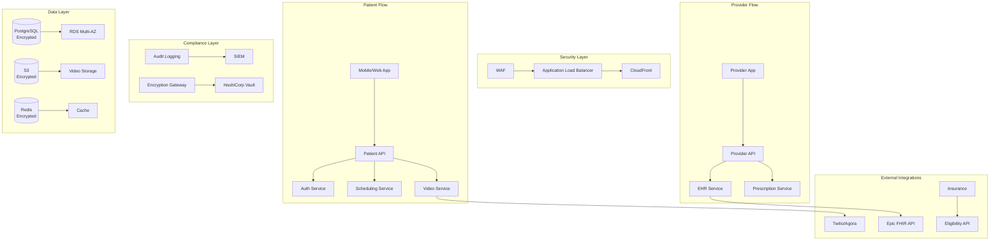

# Example 4: Healthcare Telemedicine System

## Requirement

Build a HIPAA-compliant telemedicine platform with video consultations, electronic health records (EHR) integration, prescription management, and insurance verification.

## Input

```json
{
  "requirement": "Build a HIPAA-compliant telemedicine platform with video consultations, electronic health records (EHR) integration, prescription management, and insurance verification",
  "constraints": {
    "compliance": ["HIPAA", "SOC2"],
    "video_quality": "720p minimum",
    "session_recording": true,
    "data_retention_years": 7
  },
  "options": {
    "include_failure_modes": true,
    "include_adrs": true,
    "include_mermaid": true,
    "depth": "comprehensive"
  }
}
```

## Generated Architecture

### Security-First Design

| Layer | Component | Security Measure |
|-------|-----------|-------------------|
| Edge | WAF | AWS WAF, rate limiting |
| Network | VPC | Private subnets, NAT |
| Application | IAM | RBAC, OAuth 2.0 |
| Data | Encryption | AES-256 at rest, TLS 1.3 |
| Audit | Logging | Immutable audit logs |

### Core Services

| Service | Purpose | Compliance |
|---------|---------|------------|
| Patient Portal | Patient-facing UI | HIPAA |
| Provider Portal | Doctor dashboard | HIPAA |
| Video Service | WebRTC streaming | HIPAA |
| Scheduling | Appointment booking | SOC2 |
| EHR Service | Medical records | HIPAA |
| Prescription | e-Prescribing | DEA Schedule |
| Insurance | Verification | SOC2 |
| Notification | SMS/Email | TCPA |

### Architecture Diagram



### HIPAA Compliance Implementation

**Data Classification**
```python
class DataClassifier:
    PHI_FIELDS = [
        'patient_name', 'ssn', 'dob', 'address',
        'medical_record_number', 'diagnosis', 'treatment'
    ]
    
    def classify(self, data: dict) -> List[DataCategory]:
        categories = []
        for field, value in data.items():
            if field in self.PHI_FIELDS:
                categories.append(DataCategory.PHI)
            elif field in ['email', 'phone']:
                categories.append(DataCategory.PII)
            else:
                categories.append(DataCategory.GENERAL)
        return categories
```

**Encryption at Rest**
```python
class PHIDatabase(EncryptedPostgres):
    def __init__(self):
        super().__init__(
            encryption_key_vault="hashicorp-vault",
            algorithm="AES-256-GCM",
            key_rotation_days=90
        )
    
    def insert_patient_record(self, record: PatientRecord):
        encrypted_record = self.encrypt(record)
        return super().insert(encrypted_record)
```

### Key Decisions (ADRs)

**ADR-001: Third-Party Video Provider**
- Context: WebRTC complexity and HIPAA compliance
- Decision: Use Twilio/Agora with BAA
- Consequences: Less control, but faster compliance

**ADR-002: FHIR for EHR Integration**
- Context: Standard interoperability requirements
- Decision: FHIR R4 API for all EHR data
- Consequences: Slower initial development, better long-term

**ADR-003: Immutable Audit Logs**
- Context: HIPAA audit trail requirements
- Decision: Write-only S3 with Glacier
- Consequences: Higher storage cost, legal protection

### Failure Modes

| Service | Failure Mode | HIPAA Impact | Mitigation |
|---------|--------------|--------------|------------|
| Video | Call drops | Minor | Session state recovery |
| EHR | Integration failure | Critical | Local cache, retry |
| Auth | Session timeout | Medium | Graceful re-auth |
| Encryption | Key loss | Critical | HSM backup, key escrow |

## Implementation Phases

1. **Security Foundation (Weeks 1-8)**: VPC, encryption, IAM, audit logging
2. **Core Telemedicine (Weeks 9-16)**: Video, scheduling, basic messaging
3. **EHR Integration (Weeks 17-22)**: FHIR implementation, data mapping
4. **Prescription (Weeks 23-28)**: e-Prescribing, DEA compliance
5. **Insurance (Weeks 29-32)**: Eligibility verification, billing
6. **Certification (Weeks 33-36)**: HIPAA audit, SOC2 certification

## Cost Estimate

- Infrastructure: ~$20,000/month
- Compliance Certification: ~$100,000
- Third-party APIs: ~$5,000/month
- Development: ~300 developer-weeks
