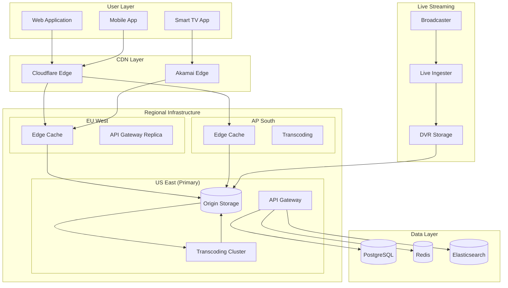

# Example 5: Multi-Region Content Delivery Platform

## Requirement

Design a global content delivery platform serving 100 million users with <50ms latency, supporting live streaming, video-on-demand, and user-generated content with 99.99% availability.

## Input

```json
{
  "requirement": "Design a global content delivery platform serving 100 million users with less than 50ms latency, supporting live streaming, video-on-demand, and user-generated content with 99.99% availability",
  "constraints": {
    "global_regions": ["us-east", "eu-west", "ap-south", "sa-east"],
    "availability": 0.9999,
    "latency_p99_ms": 50,
    "storage_petabytes": 10
  },
  "options": {
    "include_failure_modes": true,
    "include_adrs": true,
    "include_mermaid": true,
    "depth": "comprehensive"
  }
}
```

## Generated Architecture

### Global Infrastructure

| Region | PoP Count | Primary Services |
|--------|-----------|------------------|
| US East | 5 | Origin, Transcoding, API |
| EU West | 4 | Edge, API replica |
| AP South | 3 | Edge, Transcoding |
| SA East | 2 | Edge only |

### Component Architecture

| Component | Technology | Purpose |
|-----------|------------|---------|
| CDN Edge | Cloudflare/Akamai | Global caching |
| Origin Storage | Ceph/S3 | Source of truth |
| Transcoding | FFmpeg/Kubernetes | Video processing |
| Live Ingest | RTMP/HLS | Stream ingestion |
| API Gateway | Kong | Request routing |
| User Service | Go | Authentication |
| Content Service | Go | Metadata management |
| Recommendation | Python/ML | Content suggestions |

### Architecture Diagram



### Multi-Region Strategy

**Active-Active Deployment**
```yaml
# Kubernetes multi-region config
regions:
  us-east:
    replicas: 10
    priority: 1
  eu-west:
    replicas: 6
    priority: 2
  ap-south:
    replicas: 4
    priority: 3

failover:
  automatic: true
  health_check_interval: 10s
  failover_threshold: 3
```

**Data Replication**
```python
class GlobalDataStore:
    def __init__(self):
        self.primary = "us-east"
        self.replicas = {
            "eu-west": "read-replica",
            "ap-south": "read-replica"
        }
    
    def write(self, key: str, value: Any):
        self.route_to_region(self.primary).set(key, value)
        self.replicate_async(key, value)
    
    def read(self, key: str) -> Any:
        region = self.route_by_latency()
        return self.route_to_region(region).get(key)
```

### Key Decisions (ADRs)

**ADR-001: Multi-CDN Strategy**
- Context: Need 99.99% availability, no single point of failure
- Decision: Primary (Cloudflare) + Secondary (Akamai)
- Consequences: Higher cost, complex configuration

**ADR-002: Origin as Source of Truth**
- Context: Video integrity is critical
- Decision: All content originates from single primary origin
- Consequences: Need robust backup, replication

**ADR-003: Edge-first Architecture**
- Context: <50ms latency requirement
- Decision: Cache everything at edge, origin as backup
- Consequences: Cache invalidation complexity, storage cost

### Live Streaming Pipeline

```python
class LiveStreamProcessor:
    def __init__(self):
        self.ingester = RTMPIngester()
        self.transcoder = AdaptiveTranscoder()
        self.dvr = DVRStorage()
    
    async def process_stream(self, stream_id: str):
        async for chunk in self.ingester.subscribe(stream_id):
            # Transcode to multiple qualities
            variants = await self.transcoder.transcode(chunk)
            
            # Store for DVR
            await self.dvr.append(stream_id, chunk)
            
            # Push to CDN
            await self.cdn.push(stream_id, variants)
```

### Failure Modes & Mitigations

| Component | Failure | Availability Impact | Mitigation |
|-----------|---------|---------------------|------------|
| CDN Edge | PoP down | Regional outage | Traffic reroute to other PoPs |
| Origin Storage | Corruption | All regions affected | Geo-replication, checksums |
| Transcoding | Job queue overflow | New uploads delayed | Auto-scaling, queue priority |
| Database | Primary failure | Write failures | Multi-region replication |
| API Gateway | DDoS | Service unavailable | WAF, rate limiting |

### Disaster Recovery

```yaml
# DR Configuration
disaster_recovery:
  rpo: 1 hour
  rto: 15 minutes
  
  backup:
    frequency: hourly
    retention: 30 days
    destination: cross-region S3
  
  failover:
    trigger: availability < 99%
    method: DNS failover
    health_check: synthetic transactions
```

## Implementation Phases

1. **Foundation (Weeks 1-6)**: Multi-region VPCs, CDN setup
2. **Content Pipeline (Weeks 7-12)**: Transcoding, origin storage
3. **Live Streaming (Weeks 13-18)**: RTMP ingest, DVR
4. **Global API (Weeks 19-24)**: API gateway, user service
5. **Resilience (Weeks 25-30)**: Failover, DR testing
6. **Optimization (Weeks 31-36)**: Performance tuning, cost optimization

## Cost Estimate

- CDN (100M users): ~$500,000/month
- Origin Storage (10PB): ~$200,000/month
- Transcoding: ~$100,000/month
- Infrastructure: ~$300,000/month
- **Total Monthly**: ~$1.1M/month

## Performance Targets

| Metric | Target | Measurement |
|--------|--------|-------------|
| Time to First Byte | <20ms | CDN edge |
| Video Start Time | <2s | 95th percentile |
| API Response | <50ms | P99 |
| Availability | 99.99% | Monthly SLA |
| Error Rate | <0.01% | All requests |
